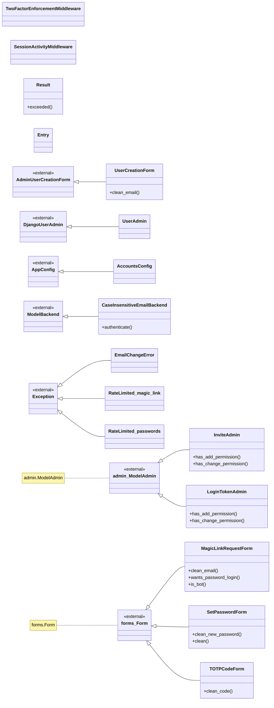
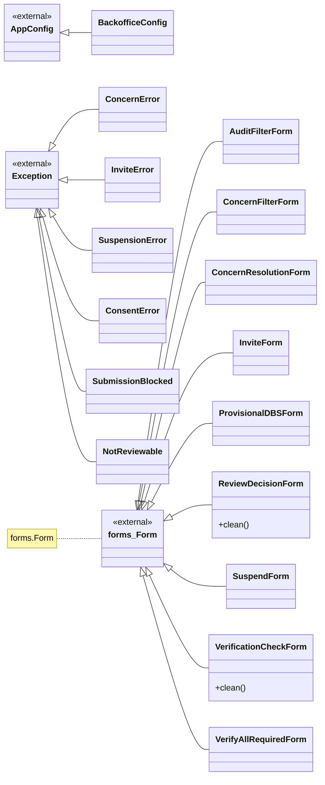
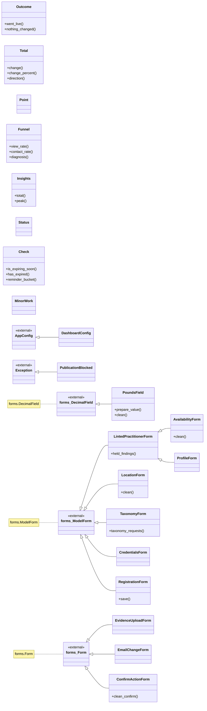
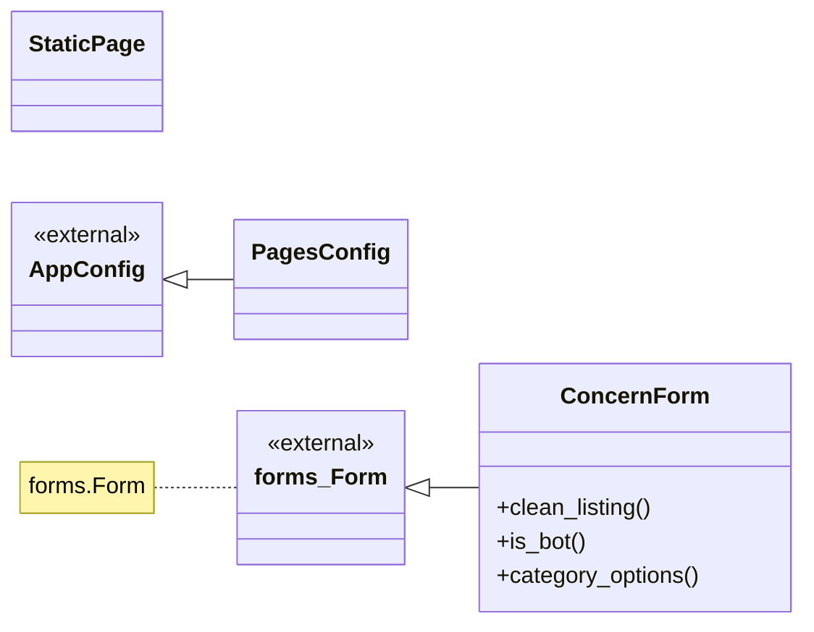
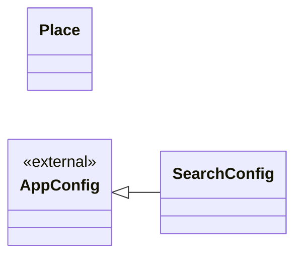
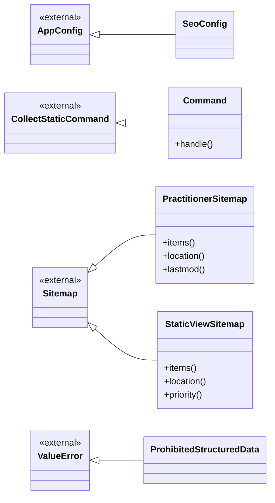

<!-- GENERATED FILE — do not edit by hand.
     Regenerate with:  .venv/bin/python .claude/skills/uml/generate_uml.py
     Source of truth is the code; edit the code, then regenerate. -->

# UML — classes outside the data model

Admin, forms, views, services, middleware, backends, storages and commands. Model classes are not repeated here — they are in [`models.md`](models.md).

Read from the class statement itself, so a base class is the name written in the source. Classes defined in this repo are drawn solid; a base that comes from Django, a third party or another module is marked `<<external>>`.

## `accounts`

| Class | Inherits | Defined in | Purpose |
| --- | --- | --- | --- |
| `UserCreationForm` | `AdminUserCreationForm` | [`apps/accounts/admin.py`](../../apps/accounts/admin.py#L19) | Django's admin creation form, with two changes this project needs. |
| `UserAdmin` | `DjangoUserAdmin` | [`apps/accounts/admin.py`](../../apps/accounts/admin.py#L72) |  |
| `LoginTokenAdmin` | `admin.ModelAdmin` | [`apps/accounts/admin.py`](../../apps/accounts/admin.py#L130) | Read-only on purpose. See the module docstring. |
| `InviteAdmin` | `admin.ModelAdmin` | [`apps/accounts/admin.py`](../../apps/accounts/admin.py#L149) | Read-only until Phase 2 builds the issue/accept flow. |
| `AccountsConfig` | `AppConfig` | [`apps/accounts/apps.py`](../../apps/accounts/apps.py#L4) | Thin User, magic-link authentication, and every role predicate in access.py. |
| `CaseInsensitiveEmailBackend` | `ModelBackend` | [`apps/accounts/backends.py`](../../apps/accounts/backends.py#L27) | ``ModelBackend``, but the email lookup ignores case. |
| `MagicLinkRequestForm` | `forms.Form` | [`apps/accounts/forms.py`](../../apps/accounts/forms.py#L13) | Sign in — by password, or by emailing a link. |
| `TOTPCodeForm` | `forms.Form` | [`apps/accounts/forms.py`](../../apps/accounts/forms.py#L65) | A six-digit code from an authenticator app. |
| `SetPasswordForm` | `forms.Form` | [`apps/accounts/forms.py`](../../apps/accounts/forms.py#L90) | Set or change a password. |
| `TwoFactorEnforcementMiddleware` | — | [`apps/accounts/middleware.py`](../../apps/accounts/middleware.py#L49) | Redirect unverified staff sessions to enrolment or the TOTP challenge. |
| `SessionActivityMiddleware` | — | [`apps/accounts/middleware.py`](../../apps/accounts/middleware.py#L98) | Keep `UserSession` in step with the session this request arrived on. |
| `EmailChangeError` | `Exception` | [`apps/accounts/services/email_change.py`](../../apps/accounts/services/email_change.py#L54) | The change cannot be started or applied. Message is shown to the user. |
| `RateLimited` | `Exception` | [`apps/accounts/services/magic_link.py`](../../apps/accounts/services/magic_link.py#L71) | Too many magic-link requests for this email or this address. |
| `RateLimited` | `Exception` | [`apps/accounts/services/passwords.py`](../../apps/accounts/services/passwords.py#L50) | Too many password attempts for this email or this address. |
| `Result` | — | [`apps/accounts/services/ratelimit.py`](../../apps/accounts/services/ratelimit.py#L27) | The outcome of one ``hit``. |
| `Entry` | — | [`apps/accounts/services/sessions.py`](../../apps/accounts/services/sessions.py#L75) |  |

## `backoffice`

| Class | Inherits | Defined in | Purpose |
| --- | --- | --- | --- |
| `BackofficeConfig` | `AppConfig` | [`apps/backoffice/apps.py`](../../apps/backoffice/apps.py#L4) | Admin queues: invites, review, verification workbench, suspensions. Empty until Phase 2. |
| `InviteForm` | `forms.Form` | [`apps/backoffice/forms.py`](../../apps/backoffice/forms.py#L17) |  |
| `ReviewDecisionForm` | `forms.Form` | [`apps/backoffice/forms.py`](../../apps/backoffice/forms.py#L30) | Approve / request changes / reject, with notes. |
| `VerificationCheckForm` | `forms.Form` | [`apps/backoffice/forms.py`](../../apps/backoffice/forms.py#L70) | One row of the workbench. |
| `ProvisionalDBSForm` | `forms.Form` | [`apps/backoffice/forms.py`](../../apps/backoffice/forms.py#L104) | Granting a provisional window. |
| `SuspendForm` | `forms.Form` | [`apps/backoffice/forms.py`](../../apps/backoffice/forms.py#L128) |  |
| `ConcernResolutionForm` | `forms.Form` | [`apps/backoffice/forms.py`](../../apps/backoffice/forms.py#L139) |  |
| `AuditFilterForm` | `forms.Form` | [`apps/backoffice/forms.py`](../../apps/backoffice/forms.py#L147) |  |
| `ConcernFilterForm` | `forms.Form` | [`apps/backoffice/forms.py`](../../apps/backoffice/forms.py#L156) |  |
| `VerifyAllRequiredForm` | `forms.Form` | [`apps/backoffice/forms.py`](../../apps/backoffice/forms.py#L163) | Grant the badge in one action. |
| `ConcernError` | `Exception` | [`apps/backoffice/services/concerns.py`](../../apps/backoffice/services/concerns.py#L32) | The concern cannot be actioned. |
| `InviteError` | `Exception` | [`apps/backoffice/services/invites.py`](../../apps/backoffice/services/invites.py#L39) | The invite cannot be issued or accepted. |
| `SuspensionError` | `Exception` | [`apps/backoffice/services/publication.py`](../../apps/backoffice/services/publication.py#L54) | The suspension cannot be applied. |
| `ConsentError` | `Exception` | [`apps/backoffice/services/publication.py`](../../apps/backoffice/services/publication.py#L217) | The withdrawal cannot be applied. |
| `SubmissionBlocked` | `Exception` | [`apps/backoffice/services/review.py`](../../apps/backoffice/services/review.py#L79) | The lint refused this submission. Carries the findings. |
| `NotReviewable` | `Exception` | [`apps/backoffice/services/review.py`](../../apps/backoffice/services/review.py#L87) | The profile is not in a state a reviewer can act on. |

## `dashboard`

| Class | Inherits | Defined in | Purpose |
| --- | --- | --- | --- |
| `DashboardConfig` | `AppConfig` | [`apps/dashboard/apps.py`](../../apps/dashboard/apps.py#L4) | Practitioner self-service. Empty until Phase 6. |
| `PoundsField` | `forms.DecimalField` | [`apps/dashboard/forms.py`](../../apps/dashboard/forms.py#L58) | Pounds on the screen, pence in the column. |
| `LintedPractitionerForm` | `forms.ModelForm` | [`apps/dashboard/forms.py`](../../apps/dashboard/forms.py#L87) | A practitioner ModelForm that refuses copy the content rules block. |
| `ProfileForm` | `LintedPractitionerForm` | [`apps/dashboard/forms.py`](../../apps/dashboard/forms.py#L137) | Who you are and how to reach you. |
| `LocationForm` | `forms.ModelForm` | [`apps/dashboard/forms.py`](../../apps/dashboard/forms.py#L214) | One practice address, geocoded on save. |
| `TaxonomyForm` | `forms.ModelForm` | [`apps/dashboard/forms.py`](../../apps/dashboard/forms.py#L353) | What you work with, how, and who with. |
| `CredentialsForm` | `forms.ModelForm` | [`apps/dashboard/forms.py`](../../apps/dashboard/forms.py#L426) | Prescribing status. The qualifications and registrations are formsets. |
| `RegistrationForm` | `forms.ModelForm` | [`apps/dashboard/forms.py`](../../apps/dashboard/forms.py#L454) | One registration, and it stops being verified when its identity changes. |
| `AvailabilityForm` | `LintedPractitionerForm` | [`apps/dashboard/forms.py`](../../apps/dashboard/forms.py#L505) | Everything on this page publishes immediately. Nothing here is controlled. |
| `EvidenceUploadForm` | `forms.Form` | [`apps/dashboard/forms.py`](../../apps/dashboard/forms.py#L585) | One document, for one check. |
| `EmailChangeForm` | `forms.Form` | [`apps/dashboard/forms.py`](../../apps/dashboard/forms.py#L613) |  |
| `ConfirmActionForm` | `forms.Form` | [`apps/dashboard/forms.py`](../../apps/dashboard/forms.py#L624) | A typed confirmation. The word names the action being taken. |
| `Outcome` | — | [`apps/dashboard/services/editing.py`](../../apps/dashboard/services/editing.py#L89) | What happened, in the terms the practitioner needs to be told. |
| `PublicationBlocked` | `Exception` | [`apps/dashboard/services/editing.py`](../../apps/dashboard/services/editing.py#L126) | The edit would leave a LIVE listing in a state that may not be published. |
| `Total` | — | [`apps/dashboard/services/insights.py`](../../apps/dashboard/services/insights.py#L67) | One counter over a window, against the window before it. |
| `Point` | — | [`apps/dashboard/services/insights.py`](../../apps/dashboard/services/insights.py#L101) |  |
| `Funnel` | — | [`apps/dashboard/services/insights.py`](../../apps/dashboard/services/insights.py#L107) | Impressions → views → contacts, and what a bad rate at each step means. |
| `Insights` | — | [`apps/dashboard/services/insights.py`](../../apps/dashboard/services/insights.py#L156) |  |
| `Status` | — | [`apps/dashboard/services/overview.py`](../../apps/dashboard/services/overview.py#L57) | Publication state, for someone who did not write the state machine. |
| `Check` | — | [`apps/dashboard/services/overview.py`](../../apps/dashboard/services/overview.py#L144) | One required verification check, as the practitioner needs to see it. |
| `MinorWork` | — | [`apps/dashboard/services/overview.py`](../../apps/dashboard/services/overview.py#L247) | The under-18 position, and the countdown when there is one. |

## `directory`

```mermaid
classDiagram
    direction LR
    class TaxonomyAdmin {
    }
    class ProfessionAdmin {
    }
    class SpecialityCategoryAdmin {
    }
    class SpecialityAdmin {
    }
    class ApproachAdmin {
    }
    class ClientGroupAdmin {
    }
    class SessionFormatAdmin {
    }
    class FundingOptionAdmin {
    }
    class LanguageAdmin {
    }
    class PractitionerLocationInline {
    }
    class RegistrationInline {
    }
    class QualificationInline {
    }
    class VerificationCheckInline {
    }
    class PractitionerAdmin {
    +verified_badge()
    +save_related()
    +recompute_verification()
    }
    class PractitionerLocationAdmin {
    }
    class VerificationCheckAdmin {
    +save_model()
    }
    class DocumentAdmin {
    +has_add_permission()
    +has_change_permission()
    }
    class DocumentAccessLogAdmin {
    +has_add_permission()
    +has_change_permission()
    +has_delete_permission()
    }
    class ReviewRequestAdmin {
    }
    class AuditLogAdmin {
    +has_add_permission()
    +has_change_permission()
    +has_delete_permission()
    }
    class ConsentRecordAdmin {
    +has_add_permission()
    +has_change_permission()
    }
    class ConcernReportAdmin {
    +has_delete_permission()
    }
    class TaxonomyRequestAdmin {
    }
    class SlugRedirectAdmin {
    }
    class DailyMetricAdmin {
    +has_add_permission()
    }
    class RegistrationAdmin {
    }
    class QualificationAdmin {
    +institution_display()
    }
    class DirectoryConfig {
    +ready()
    }
    class ProfessionFactory {
    }
    class SpecialityCategoryFactory {
    }
    class SpecialityFactory {
    }
    class ApproachFactory {
    }
    class ClientGroupFactory {
    }
    class LanguageFactory {
    }
    class FundingOptionFactory {
    }
    class SessionFormatFactory {
    }
    class PractitionerLocationFactory {
    }
    class VerificationCheckFactory {
    }
    class PractitionerFactory {
    +specialities()
    +approaches()
    +client_groups()
    +languages()
    +locations()
    +multi_location()
    +complete()
    +verified()
    +provisional_dbs()
    +dbs_cleared()
    }
    class Command_purge_expired_evidence {
    +add_arguments()
    +handle()
    }
    class Command_rebuild_search_index {
    +add_arguments()
    +handle()
    }
    class Command_seed_demo {
    +add_arguments()
    +handle()
    }
    class Command_seed_taxonomy {
    +add_arguments()
    +handle()
    }
    class Command_verification_sweep {
    +add_arguments()
    +handle()
    }
    class UploadRejected {
    }
    class ScanResult {
    }
    class Requirement {
    }
    class Item {
    +key()
    +text()
    }
    class Report {
    +done()
    +missing()
    +is_complete()
    +next_action()
    }
    class EvidenceAccessDenied {
    }
    class Finding {
    +as_dict()
    }
    class LintResult {
    +blocks()
    +holds()
    +is_blocked()
    +must_hold_for_review()
    +as_dict()
    }
    class ImproperlyConfiguredPOMDictionary {
    }
    class Resolution {
    }
    class SearchParams {
    +has_location()
    +wants_physical_venue()
    }
    class ResultPage {
    +num_pages()
    +has_previous()
    +has_next()
    +start_index()
    +end_index()
    }
    class ExpiryRequired {
    }
    class ExtensionRequiresSignOff {
    }
    class NothingToVerify {
    }
    class EvidenceNotPublic {
    }
    class _NoPublicURLMixin {
    +url()
    +signed_url()
    }
    class PrivateEvidenceStorage {
    +base_url()
    }
    class ContactChannelConverter {
    +to_python()
    +to_url()
    }
    class AppConfig {
    <<external>>
    }
    class BaseCommand {
    <<external>>
    }
    class DjangoModelFactory {
    <<external>>
    }
    class Exception {
    <<external>>
    }
    class FileSystemStorage {
    <<external>>
    }
    class PermissionDenied {
    <<external>>
    }
    class PermissionError {
    <<external>>
    }
    class RuntimeError {
    <<external>>
    }
    class SuspiciousOperation {
    <<external>>
    }
    class ValueError {
    <<external>>
    }
    class admin_ModelAdmin {
    <<external>>
    }
    note for admin_ModelAdmin "admin.ModelAdmin"
    class admin_TabularInline {
    <<external>>
    }
    note for admin_TabularInline "admin.TabularInline"
    AppConfig <|-- DirectoryConfig
    BaseCommand <|-- Command_purge_expired_evidence
    BaseCommand <|-- Command_rebuild_search_index
    BaseCommand <|-- Command_seed_demo
    BaseCommand <|-- Command_seed_taxonomy
    BaseCommand <|-- Command_verification_sweep
    DjangoModelFactory <|-- ApproachFactory
    DjangoModelFactory <|-- ClientGroupFactory
    DjangoModelFactory <|-- FundingOptionFactory
    DjangoModelFactory <|-- LanguageFactory
    DjangoModelFactory <|-- PractitionerFactory
    DjangoModelFactory <|-- PractitionerLocationFactory
    DjangoModelFactory <|-- ProfessionFactory
    DjangoModelFactory <|-- SessionFormatFactory
    DjangoModelFactory <|-- SpecialityCategoryFactory
    DjangoModelFactory <|-- SpecialityFactory
    DjangoModelFactory <|-- VerificationCheckFactory
    Exception <|-- UploadRejected
    FileSystemStorage <|-- PrivateEvidenceStorage
    PermissionDenied <|-- EvidenceAccessDenied
    PermissionError <|-- ExtensionRequiresSignOff
    RuntimeError <|-- ImproperlyConfiguredPOMDictionary
    SuspiciousOperation <|-- EvidenceNotPublic
    TaxonomyAdmin <|-- ApproachAdmin
    TaxonomyAdmin <|-- ClientGroupAdmin
    TaxonomyAdmin <|-- FundingOptionAdmin
    TaxonomyAdmin <|-- ProfessionAdmin
    TaxonomyAdmin <|-- SessionFormatAdmin
    TaxonomyAdmin <|-- SpecialityAdmin
    TaxonomyAdmin <|-- SpecialityCategoryAdmin
    ValueError <|-- ExpiryRequired
    ValueError <|-- NothingToVerify
    _NoPublicURLMixin <|-- PrivateEvidenceStorage
    admin_ModelAdmin <|-- AuditLogAdmin
    admin_ModelAdmin <|-- ConcernReportAdmin
    admin_ModelAdmin <|-- ConsentRecordAdmin
    admin_ModelAdmin <|-- DailyMetricAdmin
    admin_ModelAdmin <|-- DocumentAccessLogAdmin
    admin_ModelAdmin <|-- DocumentAdmin
    admin_ModelAdmin <|-- LanguageAdmin
    admin_ModelAdmin <|-- PractitionerAdmin
    admin_ModelAdmin <|-- PractitionerLocationAdmin
    admin_ModelAdmin <|-- QualificationAdmin
    admin_ModelAdmin <|-- RegistrationAdmin
    admin_ModelAdmin <|-- ReviewRequestAdmin
    admin_ModelAdmin <|-- SlugRedirectAdmin
    admin_ModelAdmin <|-- TaxonomyAdmin
    admin_ModelAdmin <|-- TaxonomyRequestAdmin
    admin_ModelAdmin <|-- VerificationCheckAdmin
    admin_TabularInline <|-- PractitionerLocationInline
    admin_TabularInline <|-- QualificationInline
    admin_TabularInline <|-- RegistrationInline
    admin_TabularInline <|-- VerificationCheckInline
```

| Class | Inherits | Defined in | Purpose |
| --- | --- | --- | --- |
| `TaxonomyAdmin` | `admin.ModelAdmin` | [`apps/directory/admin.py`](../../apps/directory/admin.py#L72) | Shared shape for the vocabulary models. |
| `ProfessionAdmin` | `TaxonomyAdmin` | [`apps/directory/admin.py`](../../apps/directory/admin.py#L88) |  |
| `SpecialityCategoryAdmin` | `TaxonomyAdmin` | [`apps/directory/admin.py`](../../apps/directory/admin.py#L94) |  |
| `SpecialityAdmin` | `TaxonomyAdmin` | [`apps/directory/admin.py`](../../apps/directory/admin.py#L99) |  |
| `ApproachAdmin` | `TaxonomyAdmin` | [`apps/directory/admin.py`](../../apps/directory/admin.py#L106) |  |
| `ClientGroupAdmin` | `TaxonomyAdmin` | [`apps/directory/admin.py`](../../apps/directory/admin.py#L111) |  |
| `SessionFormatAdmin` | `TaxonomyAdmin` | [`apps/directory/admin.py`](../../apps/directory/admin.py#L117) |  |
| `FundingOptionAdmin` | `TaxonomyAdmin` | [`apps/directory/admin.py`](../../apps/directory/admin.py#L122) |  |
| `LanguageAdmin` | `admin.ModelAdmin` | [`apps/directory/admin.py`](../../apps/directory/admin.py#L128) |  |
| `PractitionerLocationInline` | `admin.TabularInline` | [`apps/directory/admin.py`](../../apps/directory/admin.py#L149) | A practitioner has MANY locations; search matches any of them. |
| `RegistrationInline` | `admin.TabularInline` | [`apps/directory/admin.py`](../../apps/directory/admin.py#L157) |  |
| `QualificationInline` | `admin.TabularInline` | [`apps/directory/admin.py`](../../apps/directory/admin.py#L163) |  |
| `VerificationCheckInline` | `admin.TabularInline` | [`apps/directory/admin.py`](../../apps/directory/admin.py#L168) | The supported way to change verification state: record the evidence. |
| `PractitionerAdmin` | `admin.ModelAdmin` | [`apps/directory/admin.py`](../../apps/directory/admin.py#L182) |  |
| `PractitionerLocationAdmin` | `admin.ModelAdmin` | [`apps/directory/admin.py`](../../apps/directory/admin.py#L363) |  |
| `VerificationCheckAdmin` | `admin.ModelAdmin` | [`apps/directory/admin.py`](../../apps/directory/admin.py#L376) | Evidence, not state. Editing here then recomputing is the workflow. |
| `DocumentAdmin` | `admin.ModelAdmin` | [`apps/directory/admin.py`](../../apps/directory/admin.py#L396) | Evidence files. Read-only, and the file itself is not linked. |
| `DocumentAccessLogAdmin` | `admin.ModelAdmin` | [`apps/directory/admin.py`](../../apps/directory/admin.py#L430) | Required for the DPIA. Append-only by definition. |
| `ReviewRequestAdmin` | `admin.ModelAdmin` | [`apps/directory/admin.py`](../../apps/directory/admin.py#L453) |  |
| `AuditLogAdmin` | `admin.ModelAdmin` | [`apps/directory/admin.py`](../../apps/directory/admin.py#L462) | Append-only. An audit log an admin can edit is not an audit log. |
| `ConsentRecordAdmin` | `admin.ModelAdmin` | [`apps/directory/admin.py`](../../apps/directory/admin.py#L482) | The lawful basis for publishing someone's data. Never editable. |
| `ConcernReportAdmin` | `admin.ModelAdmin` | [`apps/directory/admin.py`](../../apps/directory/admin.py#L499) |  |
| `TaxonomyRequestAdmin` | `admin.ModelAdmin` | [`apps/directory/admin.py`](../../apps/directory/admin.py#L517) |  |
| `SlugRedirectAdmin` | `admin.ModelAdmin` | [`apps/directory/admin.py`](../../apps/directory/admin.py#L525) |  |
| `DailyMetricAdmin` | `admin.ModelAdmin` | [`apps/directory/admin.py`](../../apps/directory/admin.py#L532) | Aggregated counters, never per-visitor rows. |
| `RegistrationAdmin` | `admin.ModelAdmin` | [`apps/directory/admin.py`](../../apps/directory/admin.py#L546) |  |
| `QualificationAdmin` | `admin.ModelAdmin` | [`apps/directory/admin.py`](../../apps/directory/admin.py#L554) |  |
| `DirectoryConfig` | `AppConfig` | [`apps/directory/apps.py`](../../apps/directory/apps.py#L4) | Practitioners, taxonomy, verification, consent, audit. Empty at Phase 0 beyond the private-evidence storage helpers; the models land in Phase 1. |
| `ProfessionFactory` | `DjangoModelFactory` | [`apps/directory/factories.py`](../../apps/directory/factories.py#L47) |  |
| `SpecialityCategoryFactory` | `DjangoModelFactory` | [`apps/directory/factories.py`](../../apps/directory/factories.py#L68) |  |
| `SpecialityFactory` | `DjangoModelFactory` | [`apps/directory/factories.py`](../../apps/directory/factories.py#L77) |  |
| `ApproachFactory` | `DjangoModelFactory` | [`apps/directory/factories.py`](../../apps/directory/factories.py#L89) |  |
| `ClientGroupFactory` | `DjangoModelFactory` | [`apps/directory/factories.py`](../../apps/directory/factories.py#L98) |  |
| `LanguageFactory` | `DjangoModelFactory` | [`apps/directory/factories.py`](../../apps/directory/factories.py#L115) |  |
| `FundingOptionFactory` | `DjangoModelFactory` | [`apps/directory/factories.py`](../../apps/directory/factories.py#L124) |  |
| `SessionFormatFactory` | `DjangoModelFactory` | [`apps/directory/factories.py`](../../apps/directory/factories.py#L134) |  |
| `PractitionerLocationFactory` | `DjangoModelFactory` | [`apps/directory/factories.py`](../../apps/directory/factories.py#L148) | A practice address. |
| `VerificationCheckFactory` | `DjangoModelFactory` | [`apps/directory/factories.py`](../../apps/directory/factories.py#L180) |  |
| `PractitionerFactory` | `DjangoModelFactory` | [`apps/directory/factories.py`](../../apps/directory/factories.py#L204) |  |
| `Command` | `BaseCommand` | [`apps/directory/management/commands/purge_expired_evidence.py`](../../apps/directory/management/commands/purge_expired_evidence.py#L44) |  |
| `Command` | `BaseCommand` | [`apps/directory/management/commands/rebuild_search_index.py`](../../apps/directory/management/commands/rebuild_search_index.py#L22) |  |
| `Command` | `BaseCommand` | [`apps/directory/management/commands/seed_demo.py`](../../apps/directory/management/commands/seed_demo.py#L166) |  |
| `Command` | `BaseCommand` | [`apps/directory/management/commands/seed_taxonomy.py`](../../apps/directory/management/commands/seed_taxonomy.py#L42) |  |
| `Command` | `BaseCommand` | [`apps/directory/management/commands/verification_sweep.py`](../../apps/directory/management/commands/verification_sweep.py#L42) |  |
| `UploadRejected` | `Exception` | [`apps/directory/services/antivirus.py`](../../apps/directory/services/antivirus.py#L73) | The file may not be stored. The message is shown to the practitioner. |
| `ScanResult` | — | [`apps/directory/services/antivirus.py`](../../apps/directory/services/antivirus.py#L78) |  |
| `Requirement` | — | [`apps/directory/services/completeness.py`](../../apps/directory/services/completeness.py#L43) | One thing a listing needs, what it is worth, and where to go and do it. |
| `Item` | — | [`apps/directory/services/completeness.py`](../../apps/directory/services/completeness.py#L215) |  |
| `Report` | — | [`apps/directory/services/completeness.py`](../../apps/directory/services/completeness.py#L229) | The meter and the checklist, from one walk of ``REQUIREMENTS``. |
| `EvidenceAccessDenied` | `PermissionDenied` | [`apps/directory/services/documents.py`](../../apps/directory/services/documents.py#L46) | Raised when someone without the verifier capability asks for evidence. |
| `Finding` | — | [`apps/directory/services/lint.py`](../../apps/directory/services/lint.py#L115) |  |
| `LintResult` | — | [`apps/directory/services/lint.py`](../../apps/directory/services/lint.py#L133) |  |
| `ImproperlyConfiguredPOMDictionary` | `RuntimeError` | [`apps/directory/services/lint.py`](../../apps/directory/services/lint.py#L223) | The POM dictionary is missing. Submissions cannot be linted safely. |
| `Resolution` | — | [`apps/directory/services/profile.py`](../../apps/directory/services/profile.py#L103) | What a slug resolved to. |
| `SearchParams` | — | [`apps/directory/services/search.py`](../../apps/directory/services/search.py#L73) |  |
| `ResultPage` | — | [`apps/directory/services/search.py`](../../apps/directory/services/search.py#L476) | One page of results, with the featured block already capped. |
| `ExpiryRequired` | `ValueError` | [`apps/directory/services/verification.py`](../../apps/directory/services/verification.py#L254) | A check of this type cannot be VERIFIED without an expiry date. |
| `ExtensionRequiresSignOff` | `PermissionError` | [`apps/directory/services/verification.py`](../../apps/directory/services/verification.py#L303) | A second extension needs Dr. Abbass sign-off recorded on the practitioner. |
| `NothingToVerify` | `ValueError` | [`apps/directory/services/verification.py`](../../apps/directory/services/verification.py#L377) | No required check is outstanding. |
| `EvidenceNotPublic` | `SuspiciousOperation` | [`apps/directory/storages.py`](../../apps/directory/storages.py#L32) | Raised when something asks a private evidence file for a public URL. |
| `_NoPublicURLMixin` | — | [`apps/directory/storages.py`](../../apps/directory/storages.py#L36) | Shared refusal. ``url()`` is the one method that must never work here. |
| `PrivateEvidenceStorage` | `_NoPublicURLMixin`, `FileSystemStorage` | [`apps/directory/storages.py`](../../apps/directory/storages.py#L68) | Local private storage, for development and tests. |
| `ContactChannelConverter` | — | [`apps/directory/urls.py`](../../apps/directory/urls.py#L18) | Only the three channels that exist. Anything else never reaches the view. |

## `pages`

| Class | Inherits | Defined in | Purpose |
| --- | --- | --- | --- |
| `PagesConfig` | `AppConfig` | [`apps/pages/apps.py`](../../apps/pages/apps.py#L4) | Static content pages, the chrome configuration callables, and the curated landing pages from Phase 7. |
| `StaticPage` | — | [`apps/pages/content.py`](../../apps/pages/content.py#L23) |  |
| `ConcernForm` | `forms.Form` | [`apps/pages/forms.py`](../../apps/pages/forms.py#L26) | Report a concern about what a listing says, or about who is on it. |

## `search`

| Class | Inherits | Defined in | Purpose |
| --- | --- | --- | --- |
| `SearchConfig` | `AppConfig` | [`apps/search/apps.py`](../../apps/search/apps.py#L4) | Query parsing, geocoding, the search view and its HTMX partials. Empty until Phase 4. |
| `Place` | — | [`apps/search/services/geocode.py`](../../apps/search/services/geocode.py#L54) | A resolved location, and how it should be described back to the user. |

## `seo`

| Class | Inherits | Defined in | Purpose |
| --- | --- | --- | --- |
| `SeoConfig` | `AppConfig` | [`apps/seo/apps.py`](../../apps/seo/apps.py#L4) | robots.txt, sitemap.xml, llms.txt and the JSON-LD helpers. This subdomain owns all of them; none is shared. |
| `ProhibitedStructuredData` | `ValueError` | [`apps/seo/jsonld.py`](../../apps/seo/jsonld.py#L42) | A graph contained a type docs/seo.md forbids on this site. |
| `Command` | `CollectStaticCommand` | [`apps/seo/management/commands/collectstatic.py`](../../apps/seo/management/commands/collectstatic.py#L37) |  |
| `StaticViewSitemap` | `Sitemap` | [`apps/seo/sitemaps.py`](../../apps/seo/sitemaps.py#L48) | Pages that always exist and are always indexable. |
| `PractitionerSitemap` | `Sitemap` | [`apps/seo/sitemaps.py`](../../apps/seo/sitemaps.py#L84) | Published profiles. |
