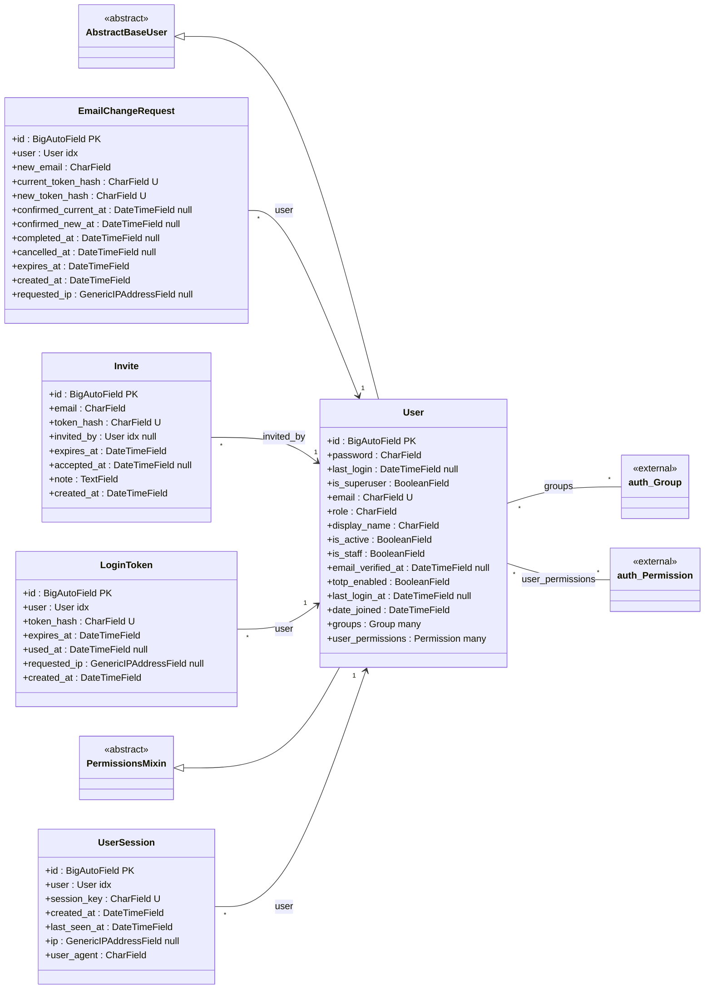

<!-- GENERATED FILE — do not edit by hand.
     Regenerate with:  .venv/bin/python .claude/skills/uml/generate_uml.py
     Source of truth is the code; edit the code, then regenerate. -->

# UML — data model

Every class, field and relation below is read out of Django's app registry, so this is what the ORM resolved rather than what a `models.py` appears to say.

Field markers: `PK` primary key · `U` unique · `idx` indexed · `null` nullable. A relation's type column names the target model; the arrow carries the cardinality.

**Apps with models:** `accounts`, `directory`

## `accounts`

### `accounts` models

| Model | Table | Purpose |
| --- | --- | --- |
| `EmailChangeRequest` | `accounts_emailchangerequest` | A pending email change, confirmed at BOTH addresses. |
| `Invite` | `accounts_invite` | Admin-issued invitation. Phase 1 is invite-only: there is no public signup route |
| `LoginToken` | `accounts_logintoken` | Single-use magic link. Store the hash, never the token. |
| `User` | `accounts_user` |  |
| `UserSession` | `accounts_usersession` | One signed-in device, so a practitioner can see and end their own sessions. |

## `directory`

```mermaid
classDiagram
    direction LR
    class Approach {
    +id : UUIDField PK
    +slug : SlugField U
    +name : CharField
    +abbreviation : CharField
    +description : TextField
    +sort_order : PositiveIntegerField
    +active : BooleanField
    }
    class AuditLog {
    +id : UUIDField PK
    +actor : User idx null
    +action : CharField
    +entity_type : CharField
    +entity_id : CharField
    +before : JSONField null
    +after : JSONField null
    +ip : GenericIPAddressField null
    +created_at : DateTimeField
    }
    class ClientGroup {
    +id : UUIDField PK
    +slug : SlugField U
    +name : CharField
    +min_age : PositiveSmallIntegerField null
    +max_age : PositiveSmallIntegerField null
    +is_minors : BooleanField
    +sort_order : PositiveIntegerField
    +active : BooleanField
    }
    class ConcernReport {
    +id : UUIDField PK
    +practitioner : Practitioner idx
    +category : CharField
    +detail : TextField
    +reporter_email : CharField
    +handled_by : User idx null
    +handled_at : DateTimeField null
    +outcome : TextField
    +created_at : DateTimeField
    }
    class ConsentRecord {
    +id : UUIDField PK
    +practitioner : Practitioner idx
    +terms_version : CharField
    +consent_publish : BooleanField
    +consent_registered : BooleanField
    +consent_independent : BooleanField
    +consent_accurate : BooleanField
    +consent_removal_path : BooleanField
    +signed_name : CharField
    +ip : GenericIPAddressField null
    +user_agent : TextField
    +granted_at : DateTimeField
    +withdrawn_at : DateTimeField null
    }
    class DailyMetric {
    +id : UUIDField PK
    +practitioner : Practitioner idx
    +date : DateField
    +search_impressions : PositiveIntegerField
    +profile_views : PositiveIntegerField
    +email_reveals : PositiveIntegerField
    +phone_reveals : PositiveIntegerField
    +website_clicks : PositiveIntegerField
    }
    class Document {
    +id : UUIDField PK
    +practitioner : Practitioner idx
    +verification_check : VerificationCheck idx null
    +type : CharField
    +file : FileField
    +original_filename : CharField
    +mime_type : CharField
    +size_bytes : PositiveIntegerField
    +sha256 : CharField
    +uploaded_at : DateTimeField
    +delete_after : DateTimeField null
    }
    class DocumentAccessLog {
    +id : UUIDField PK
    +document : Document idx
    +user : User idx null
    +ip : GenericIPAddressField null
    +accessed_at : DateTimeField
    }
    class FundingOption {
    +id : UUIDField PK
    +slug : SlugField U
    +name : CharField
    +group : CharField
    +sort_order : PositiveIntegerField
    +active : BooleanField
    }
    class Language {
    +id : UUIDField PK
    +code : CharField U
    +name : CharField
    +sort_order : PositiveIntegerField
    +active : BooleanField
    }
    class Practitioner {
    +id : UUIDField PK
    +user : User U null
    +slug : SlugField U
    +full_name : CharField
    +display_title : CharField
    +post_nominals : CharField
    +pronouns : CharField
    +gender : CharField
    +headshot : FileField
    +profession : Profession idx null
    +years_experience : PositiveSmallIntegerField null
    +qualified_since : PositiveSmallIntegerField null
    +intro : TextField
    +services : TextField
    +delivery_mode : CharField
    +offers_online : BooleanField
    +online_coverage : CharField
    +is_prescriber : BooleanField
    +offers_supervision : BooleanField
    +public_email : CharField
    +public_phone : CharField
    +public_website : CharField
    +booking_url : CharField
    +accepting_new_clients : BooleanField
    +typical_wait : CharField
    +evening_appointments : BooleanField
    +weekend_appointments : BooleanField
    +availability_note : CharField
    +fee_min : PositiveIntegerField null
    +fee_max : PositiveIntegerField null
    +free_initial_call : BooleanField
    +offers_sliding_scale : BooleanField
    +status : CharField
    +published_at : DateTimeField null
    +suspended_at : DateTimeField null
    +suspended_by : User idx null
    +suspend_reason : TextField
    +last_review_at : DateTimeField null
    +completeness : PositiveSmallIntegerField
    +last_active_at : DateTimeField null
    +is_verified : BooleanField
    +credentials_checked_at : DateTimeField null
    +verification_expires_at : DateTimeField null
    +minor_work_status : CharField
    +provisional_expires_at : DateTimeField null
    +provisional_extensions : PositiveSmallIntegerField
    +plan_tier : CharField
    +featured_until : DateTimeField null
    +search_vector : SearchVectorField null
    +created_at : DateTimeField
    +updated_at : DateTimeField
    +specialities : Speciality many
    +approaches : Approach many
    +client_groups : ClientGroup many
    +languages : Language many
    +funding_options : FundingOption many
    +session_formats : SessionFormat many
    }
    class PractitionerLocation {
    +id : UUIDField PK
    +practitioner : Practitioner idx
    +label : CharField
    +address_line1 : CharField
    +address_line2 : CharField
    +city : CharField
    +county : CharField
    +postcode : CharField
    +country_code : CharField
    +geo : PointField
    +is_primary : BooleanField
    +is_public : BooleanField
    +days_at_site : CharField
    +step_free_access : BooleanField
    +wheelchair_access : BooleanField
    +parking_available : BooleanField
    +hearing_loop : BooleanField
    +near_public_transport : BooleanField
    +created_at : DateTimeField
    +updated_at : DateTimeField
    }
    class Profession {
    +id : UUIDField PK
    +slug : SlugField U
    +name : CharField
    +description : TextField
    +restricted : BooleanField
    +required_bodies : ArrayField
    +sort_order : PositiveIntegerField
    +active : BooleanField
    }
    class Qualification {
    +id : UUIDField PK
    +practitioner : Practitioner idx
    +title : CharField
    +institution : CharField
    +year : PositiveSmallIntegerField null
    +verified : BooleanField
    +sort_order : PositiveIntegerField
    }
    class Registration {
    +id : UUIDField PK
    +practitioner : Practitioner idx
    +body : CharField
    +registration_no : CharField
    +status : CharField
    +register_url : CharField
    +verified : BooleanField
    +verified_at : DateTimeField null
    +last_checked_at : DateTimeField null
    +expires_at : DateTimeField null
    }
    class ReviewRequest {
    +id : UUIDField PK
    +practitioner : Practitioner idx
    +snapshot : JSONField
    +changed_fields : ArrayField
    +lint_flags : JSONField
    +submitted_at : DateTimeField
    +reviewed_by : User idx null
    +reviewed_at : DateTimeField null
    +outcome : CharField
    +reviewer_notes : TextField
    }
    class SessionFormat {
    +id : UUIDField PK
    +slug : SlugField U
    +name : CharField
    +sort_order : PositiveIntegerField
    +active : BooleanField
    }
    class SlugRedirect {
    +id : UUIDField PK
    +old_slug : SlugField U
    +practitioner : Practitioner idx
    +created_at : DateTimeField
    }
    class Speciality {
    +id : UUIDField PK
    +category : SpecialityCategory idx
    +slug : SlugField U
    +name : CharField
    +synonyms : ArrayField
    +description : TextField
    +implies_minors : BooleanField
    +seo_enabled : BooleanField
    +sort_order : PositiveIntegerField
    +active : BooleanField
    }
    class SpecialityCategory {
    +id : UUIDField PK
    +slug : SlugField U
    +name : CharField
    +description : TextField
    +sort_order : PositiveIntegerField
    +active : BooleanField
    }
    class TaxonomyRequest {
    +id : UUIDField PK
    +practitioner : Practitioner idx
    +axis : CharField
    +proposed_term : CharField
    +resolved_at : DateTimeField null
    +resolution : CharField
    +created_at : DateTimeField
    }
    class VerificationCheck {
    +id : UUIDField PK
    +practitioner : Practitioner idx
    +type : CharField
    +status : CharField
    +checked_by : User idx null
    +checked_at : DateTimeField null
    +expires_at : DateTimeField null
    +reminder_sent_at : DateTimeField null
    +provisional_granted_at : DateTimeField null
    +provisional_until : DateTimeField null
    +provisional_granted_by : User idx null
    +notes : TextField
    +created_at : DateTimeField
    +updated_at : DateTimeField
    }
    class UUIDModel {
    <<abstract>>
    }
    class accounts_User {
    <<external>>
    }
    class DeliveryMode {
    <<enumeration>>
    in_person
    online
    both
    }
    class Gender {
    <<enumeration>>
    female
    male
    non_binary
    undisclosed
    }
    class MinorWorkStatus {
    <<enumeration>>
    n/a
    provisional
    cleared
    blocked
    }
    class PublicationStatus {
    <<enumeration>>
    draft
    submitted
    in_review
    changes_requested
    approved
    published
    suspended
    unpublished
    removed
    }
    class ReviewOutcome {
    <<enumeration>>
    approved
    changes_requested
    rejected
    }
    class VerificationStatus {
    <<enumeration>>
    not_submitted
    submitted
    in_review
    verified
    rejected
    expired
    }
    class VerificationType {
    <<enumeration>>
    identity
    registration
    qualification
    insurance
    dbs
    prescriber
    ico
    }
    class WaitTime {
    <<enumeration>>
    immediate
    short
    medium
    long
    closed
    }
    AuditLog "*" --> "1" accounts_User : actor
    ConcernReport "*" --> "1" Practitioner : practitioner
    ConcernReport "*" --> "1" accounts_User : handled_by
    ConsentRecord "*" --> "1" Practitioner : practitioner
    DailyMetric "*" --> "1" Practitioner : practitioner
    Document "*" --> "1" Practitioner : practitioner
    Document "*" --> "1" VerificationCheck : verification_check
    Document ..> VerificationType : type
    DocumentAccessLog "*" --> "1" Document : document
    DocumentAccessLog "*" --> "1" accounts_User : user
    Practitioner "*" -- "*" Approach : approaches
    Practitioner "*" -- "*" ClientGroup : client_groups
    Practitioner "*" -- "*" FundingOption : funding_options
    Practitioner "*" -- "*" Language : languages
    Practitioner "*" -- "*" SessionFormat : session_formats
    Practitioner "*" -- "*" Speciality : specialities
    Practitioner "*" --> "1" Profession : profession
    Practitioner "*" --> "1" accounts_User : suspended_by
    Practitioner "1" --> "1" accounts_User : user
    Practitioner ..> DeliveryMode : delivery_mode
    Practitioner ..> Gender : gender
    Practitioner ..> MinorWorkStatus : minor_work_status
    Practitioner ..> PublicationStatus : status
    Practitioner ..> WaitTime : typical_wait
    PractitionerLocation "*" --> "1" Practitioner : practitioner
    Qualification "*" --> "1" Practitioner : practitioner
    Registration "*" --> "1" Practitioner : practitioner
    ReviewRequest "*" --> "1" Practitioner : practitioner
    ReviewRequest "*" --> "1" accounts_User : reviewed_by
    ReviewRequest ..> ReviewOutcome : outcome
    SlugRedirect "*" --> "1" Practitioner : practitioner
    Speciality "*" --> "1" SpecialityCategory : category
    TaxonomyRequest "*" --> "1" Practitioner : practitioner
    UUIDModel <|-- Approach
    UUIDModel <|-- AuditLog
    UUIDModel <|-- ClientGroup
    UUIDModel <|-- ConcernReport
    UUIDModel <|-- ConsentRecord
    UUIDModel <|-- DailyMetric
    UUIDModel <|-- Document
    UUIDModel <|-- DocumentAccessLog
    UUIDModel <|-- FundingOption
    UUIDModel <|-- Language
    UUIDModel <|-- Practitioner
    UUIDModel <|-- PractitionerLocation
    UUIDModel <|-- Profession
    UUIDModel <|-- Qualification
    UUIDModel <|-- Registration
    UUIDModel <|-- ReviewRequest
    UUIDModel <|-- SessionFormat
    UUIDModel <|-- SlugRedirect
    UUIDModel <|-- Speciality
    UUIDModel <|-- SpecialityCategory
    UUIDModel <|-- TaxonomyRequest
    UUIDModel <|-- VerificationCheck
    VerificationCheck "*" --> "1" Practitioner : practitioner
    VerificationCheck "*" --> "1" accounts_User : checked_by
    VerificationCheck "*" --> "1" accounts_User : provisional_granted_by
    VerificationCheck ..> VerificationStatus : status
    VerificationCheck ..> VerificationType : type
```

### `directory` models

| Model | Table | Purpose |
| --- | --- | --- |
| `Approach` | `directory_approach` | HOW the practitioner works. Never names a prescription-only medicine. |
| `AuditLog` | `directory_auditlog` |  |
| `ClientGroup` | `directory_clientgroup` | WHO the practitioner sees. is_minors drives the enhanced DBS requirement. |
| `ConcernReport` | `directory_concernreport` | "Report a concern about this listing." NOT a clinical complaints channel — clinical |
| `ConsentRecord` | `directory_consentrecord` | Lawful basis for publishing a practitioner's personal data is consent, so it must be |
| `DailyMetric` | `directory_dailymetric` | What justifies the subscription in year two. Start collecting from day one. |
| `Document` | `directory_document` | Evidence files. PRIVATE storage, signed URLs only, every access logged. |
| `DocumentAccessLog` | `directory_documentaccesslog` | Required for the DPIA. Written by directory.services.documents.open_evidence(). |
| `FundingOption` | `directory_fundingoption` |  |
| `Language` | `directory_language` |  |
| `Practitioner` | `directory_practitioner` |  |
| `PractitionerLocation` | `directory_practitionerlocation` | A practitioner may practise from several addresses. Search matches ANY of them. |
| `Profession` | `directory_profession` | What the practitioner IS. Restricted titles need a matching verified registration. |
| `Qualification` | `directory_qualification` |  |
| `Registration` | `directory_registration` |  |
| `ReviewRequest` | `directory_reviewrequest` |  |
| `SessionFormat` | `directory_sessionformat` |  |
| `SlugRedirect` | `directory_slugredirect` | Preserves inbound links and accrued SEO authority when a slug changes. |
| `Speciality` | `directory_speciality` | What the practitioner TREATS. |
| `SpecialityCategory` | `directory_specialitycategory` |  |
| `TaxonomyRequest` | `directory_taxonomyrequest` | Free-text "other" submissions, triaged by admin into the controlled vocabulary. |
| `VerificationCheck` | `directory_verificationcheck` |  |

## Cross-app relations

Each row is a place where one app's table points at another's. These are the seams: a change to the target is a change to every source listed here.

| From | To | Kind |
| --- | --- | --- |
| `accounts.User.groups` | `auth.Group` | ManyToManyField |
| `accounts.User.user_permissions` | `auth.Permission` | ManyToManyField |
| `directory.AuditLog.actor` | `accounts.User` | ForeignKey |
| `directory.ConcernReport.handled_by` | `accounts.User` | ForeignKey |
| `directory.DocumentAccessLog.user` | `accounts.User` | ForeignKey |
| `directory.Practitioner.suspended_by` | `accounts.User` | ForeignKey |
| `directory.Practitioner.user` | `accounts.User` | OneToOneField |
| `directory.ReviewRequest.reviewed_by` | `accounts.User` | ForeignKey |
| `directory.VerificationCheck.checked_by` | `accounts.User` | ForeignKey |
| `directory.VerificationCheck.provisional_granted_by` | `accounts.User` | ForeignKey |
