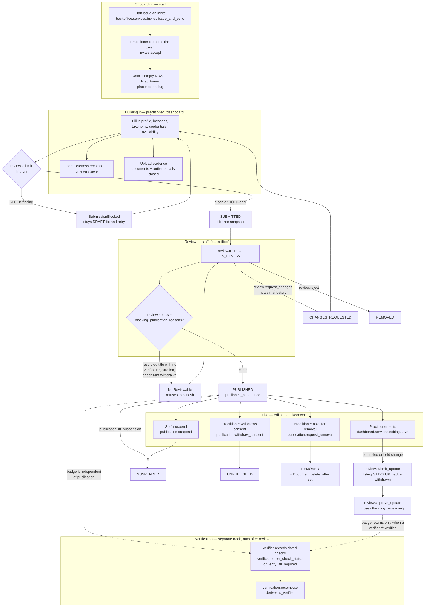
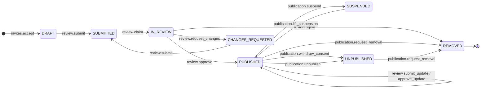
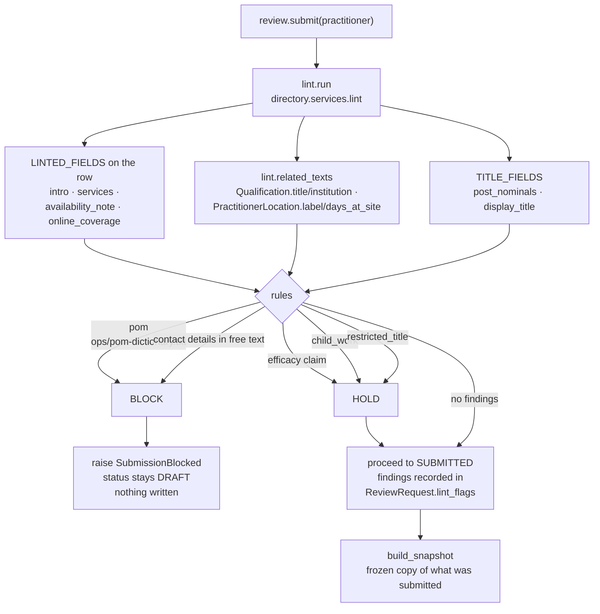
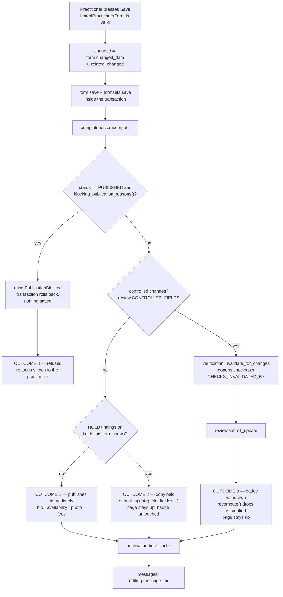
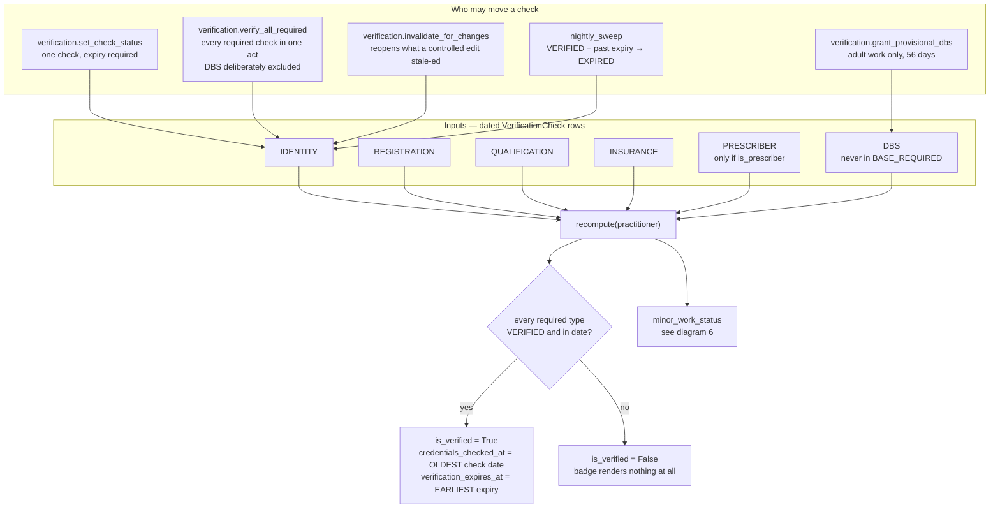
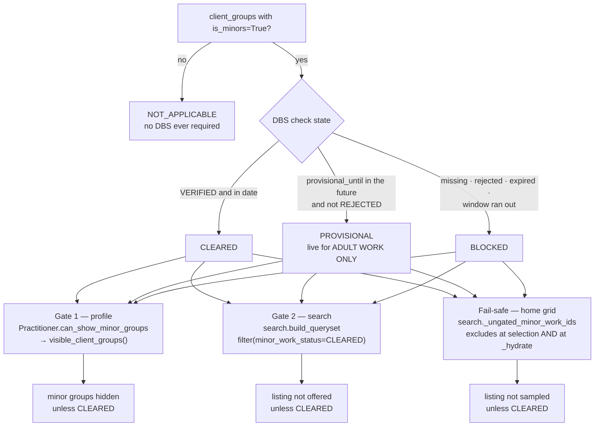
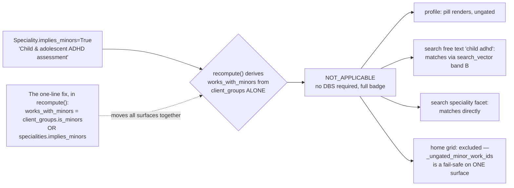
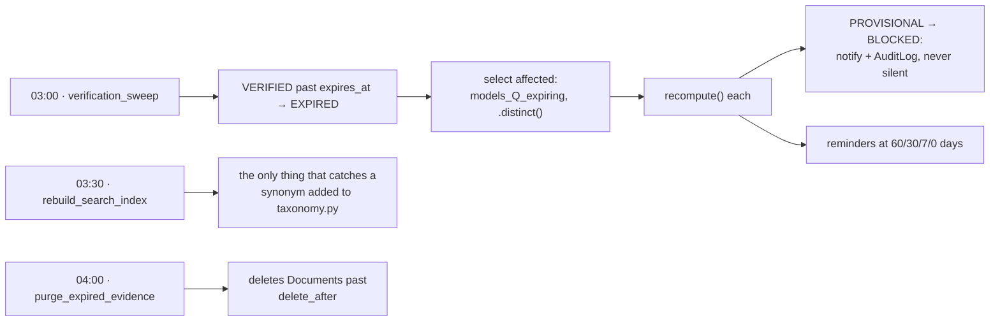

<!-- HAND-AUTHORED. Unlike models.md and classes.md in this directory, this file is
     not produced by .claude/skills/uml/generate_uml.py and a regeneration will not
     touch it. It is read from the services named in each node; when one of those
     moves, this moves with it. -->

# UML — workflows

How a listing actually moves through this project as of the post-Phase-6
corrections. Every node names the function that does the work, so a diagram
that disagrees with the code is a bug in the diagram.

The rule these diagrams are drawn to: **the work lives in the services, not in
the views.** A view authorises, binds a form and picks a template; every state
change below happens inside a service function, inside a transaction, with an
`AuditLog` row.

| Diagram | What it covers |
| --- | --- |
| [1. The listing lifecycle](#1-the-listing-lifecycle) | Invite → draft → review → live → down, end to end. |
| [2. Publication state machine](#2-publication-state-machine) | Every status and the only functions that move between them. |
| [3. Submission and the lint](#3-submission-and-the-lint) | BLOCK vs HOLD, and why the profile stays in DRAFT. |
| [4. Editing a live listing](#4-editing-a-live-listing) | The four outcomes of pressing Save in the dashboard. |
| [5. Verification and the badge](#5-verification-and-the-badge) | Why `is_verified` has no writer but `recompute()`. |
| [6. The under-18 gate](#6-the-under-18-gate) | Both gates, all three read surfaces, and the hole. |
| [7. Public read paths](#7-public-read-paths) | Profile, search and home, and what each re-checks. |
| [8. Nightly jobs](#8-nightly-jobs) | What lapses on its own overnight. |

---

## 1. The listing lifecycle

Two things in that picture are the design rather than the implementation:

* **Verification is a separate track from publication.** A listing can be live
  with no badge, and nine of twenty-eight demo listings are. Publication asks
  `blocking_publication_reasons()`; the badge asks `recompute()`. Nothing
  couples them.
* **An edit to a live listing does not take the page down.** It withdraws the
  badge, because the badge is Kiam's claim to have checked the details and the
  page is the practitioner's own copy.

---

## 2. Publication state machine

Notes that matter when reading it:

* **`PUBLISHED → PUBLISHED` is the whole point of `submit_update()`.** A
  controlled edit raises a `ReviewRequest` and reopens verification checks
  without changing publication status.
* **`APPROVED` is in `PublicationStatus` and nothing ever sets it.** The only
  reference outside tests is a label in `dashboard.services.overview`;
  `review.approve()` goes straight to `PUBLISHED`. `verification.nightly_sweep()`
  still selects `status__in=["published", "approved"]`, so it is harmless, but
  do not read it as a state a listing passes through.
* **`lift_suspension()` re-asks `blocking_publication_reasons()`.** Coming back
  online is a publication decision and gets the same gate as the first one.
* **Everything that is not `PUBLISHED` is the same 404 in public.** See
  diagram 7.

---

## 3. Submission and the lint

* **The lint runs before the state changes**, so a blocked submission leaves a
  fixable draft rather than a stuck SUBMITTED row.
* **A missing POM dictionary raises.** An empty blocklist would silently
  disable the control, so `ImproperlyConfiguredPOMDictionary` is the safe
  direction.
* **`restricted_title` holds rather than blocks**, because verification happens
  *after* review — nobody has a verified registration at submission time by
  definition. The hard refusal is `blocking_publication_reasons()` at approve.
* **HOLD only held anything from Phase 6.** Before the dashboard, `submit()`
  was the only route to those fields; now `editing.save()` passes
  `held_fields` into `submit_update()` (diagram 4).

---

## 4. Editing a live listing

`dashboard.services.editing.save()` — one transaction, four possible outcomes.

Four things here are load-bearing:

* **The publication gate is checked after the write and inside the
  transaction**, so it asks the authoritative function about the actual end
  state rather than predicting it. Two routes to a restricted title with no
  registration were found this way at the Phase 6 gate; a third cannot slip
  past a predicate that only knew about two.
* **`related_changed` is a required argument, not inferred.**
  `registrations` and `qualifications` are separate models and never appear in
  `form.changed_data`. A caller that forgets leaves a badge on against an
  unchecked GMC number.
* **Only findings about fields *this* form shows become errors.** Otherwise a
  bad intro blocks somebody from editing their opening hours, with an error
  pointing at a field that is not on the page.
* **`bust_cache` runs on every changed save.** Until Phase 6 it was reached
  only from staff transitions, which was sufficient when staff were the only
  people who could change a live listing.

---

## 5. Verification and the badge

`directory.services.verification.recompute()` is the **only** writer of the five
computed fields. `apps/directory/tests/test_admin_readonly.py` walks the whole
admin registry to keep it that way.

* **There is no admin toggle and none may be added.** The moment a human can
  set the badge, someone sets it as a favour and it stops meaning anything.
* **`verify_all_required()` is not a toggle.** It writes the same dated,
  expiring, per-check audit-logged rows a verifier would write one at a time.
  The expiry date is required and **deliberately not prefilled** — that is the
  thing that makes a one-click grant safe.
* **The badge shows the oldest check date and the earliest expiry.** It is only
  as fresh as its weakest element.
* **Approving copy never restores a badge.** `review.approve_update()` changes
  no verification state; only a verifier re-verifying the reopened checks does.

---

## 6. The under-18 gate

Two enforcement points, and **either alone leaks**. Any change to one requires a
matching change and test in the other.

The trap the search half has and the profile half does not: `group=adults&group=adolescents`
is an **OR** over client groups, so a PROVISIONAL practitioner matches the adults
half. Asking about under-18s *at all* triggers the gate, not asking about them
exclusively.

`apps/directory/tests/test_search_minors_gate.py` ends with a grep asserting both
call sites are still in the source, because deleting either would leave the
other's tests green.

### The hole, still open

The fix belongs in `recompute()` precisely so the profile, the search filter and
the DBS requirement move together instead of forming another one-sided gate. It
is a safeguarding decision and waits on **Dr. Abbass / CQC lead**.
`/how-verification-works/` is narrowed to claim only what is enforced meanwhile.

An explicitly *selected* `implies_minors` speciality does already trigger the
gate (`search._requests_minor_work`) — a fail-safe interim, not the fix.

---

## 7. Public read paths

```mermaid
flowchart TD
    subgraph profile["/p/&lt;slug&gt;/ — directory.views.profile"]
        P1["profile.resolve(slug)"] --> P2{"publication.is_publicly_visible<br/>status == PUBLISHED?"}
        P2 -->|"no"| P3["ONE 404 for suspended,<br/>draft and never-existed alike"]
        P2 -->|"yes"| P4["profile.build()"]
        P4 --> P5["visible_client_groups — gate 1"]
        P4 --> P6["available_channels()<br/>NO contact values in context"]
        P4 --> P7["independence notice partial<br/>+ jsonld.person, no email/tel/sameAs"]
        P6 --> P8["POST /contact/ only<br/>+ per-IP limit + X-Robots-Tag<br/>focus moves, no aria-live"]
    end

    subgraph search["/search/ — search.views.search"]
        S1["params.parse → SearchParams"] --> S2["geocode: postcode → point"]
        S2 --> S3["directory.services.search.build_queryset"]
        S3 --> S4["_location_filter — ONE Q<br/>never a second .filter(locations…)"]
        S3 --> S5["minors gate — gate 2"]
        S5 --> S6["results_page<br/>featured split, FEATURED_CAP_PER_PAGE"]
        S6 --> S7{"request.htmx?"}
        S7 -->|"yes"| S8["partials/_results.html<br/>+ hx-swap-oob count"]
        S7 -->|"no / crawler"| S9["full page — one form wraps<br/>bar, sidebar and #results"]
    end

    subgraph home["/ — pages.views.home"]
        H1["home.grid()"] --> H2{"cache hit and<br/>version == CACHE_VERSION?"}
        H2 -->|"no"| H3["_build_grid_payload<br/>store PRIMARY KEYS only"]
        H2 -->|"yes"| H4["_hydrate(ids)"]
        H3 --> H4
        H4 --> H5["re-apply status=PUBLISHED<br/>AND re-apply the minors exclusion"]
    end
```

* **The cache holds primary keys, not rows and not HTML.** A `bust_cache()`
  that never fires still cannot leave a suspended listing on the busiest page
  on the site, and a migration cannot turn Redis into a 500.
* **`CACHE_VERSION` covers shape *or meaning*.** A selection rule is as much
  part of a cached payload as its keys are — two Phase 5 fixes were invisible
  for as long as the old entry lived.
* **Non-JS and crawler requests get the full page.**
  `test_search_works_completely_without_javascript` is the one that must never
  be allowed to fail.
* **Facet URLs are `noindex, follow`** with a canonical to the base search
  page. The indexable surface is the curated landing pages, not the facet
  engine.

---

## 8. Nightly jobs

`ops/crontab`, `TZ=Europe/London`.

A missed sweep night is a reminder nobody receives — the thresholds are exact
day buckets, and `days_left in REMINDER_DAYS` skips anything it steps over.

The sweep's *selection* queryset is where the worst Phase 3 defect lived: an
expired enhanced DBS left `minor_work_status` at `CLEARED` because DBS is not in
`BASE_REQUIRED` and the other clauses only covered `PROVISIONAL`. **A computed
field is only as good as the thing that remembers to recompute it.**

Between sweeps, `recompute()` is also reached from every verification write and
from `invalidate_for_changes()`, and the search index from `post_save` on
`Practitioner` **plus** `m2m_changed` on `specialities` — an M2M change fires no
save signal.
